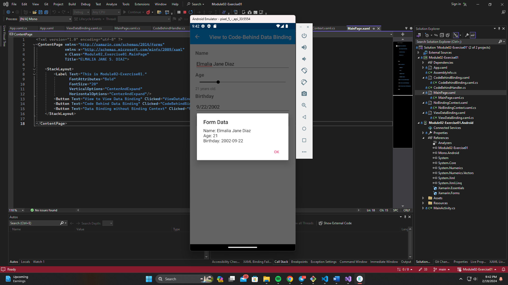

# Module 02 - Exercise 01 (PDC03-LAB)

    Name of Student: Elmalia Jane S. Diaz
    Year and Section: BSIT3A
    Activity Title: Module 02 - Exercise01
    Date Submitted: February 19, 2024
    
## App and MainPage
### Source Code
- [App.xaml.cs](Module02-Exercise01/Module02-Exercise01/App.xaml.cs)
- [MainPage.xaml](Module02-Exercise01/Module02-Exercise01/MainPage.xaml)
- [MainPage.xaml.cs](Module02-Exercise01/Module02-Exercise01/MainPage.xaml.cs)
### Output Screenshot

## ViewDataBinding
### Source Code
- [ViewDataBinding.xaml](Module02-Exercise01/Module02-Exercise01/ViewDataBinding.xaml)
### Output Screenshots

## CodeBehindBinding
### Source Code
- [CodeBehindBinding.xaml](Module02-Exercise01/Module02-Exercise01/CodeBehindBinding.xaml)
- [CodeBehindBinding.xaml.cs](Module02-Exercise01/Module02-Exercise01/CodeBehindBinding.xaml.cs)
- [CodeBehindHandler.cs](Module02-Exercise01/Module02-Exercise01/CodeBehindHandler.cs)
### Output Screenshots

## NoBindingContext
### Source Code
- [NoBindingContext.xaml](Module02-Exercise01/Module02-Exercise01/NoBindingContext.xaml)
### Output Screenshots

