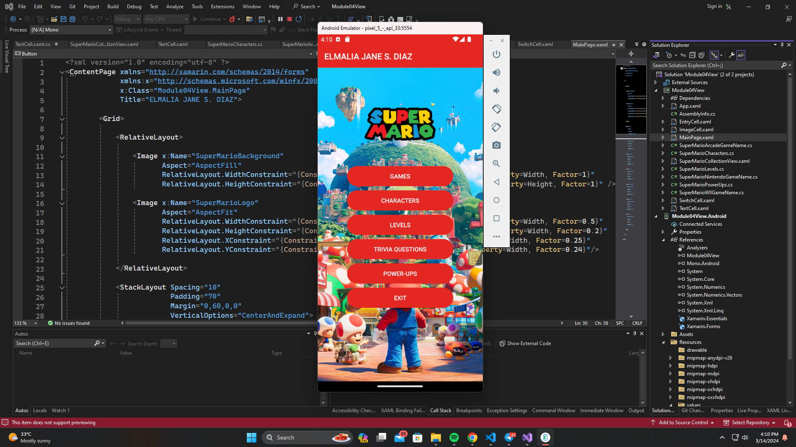
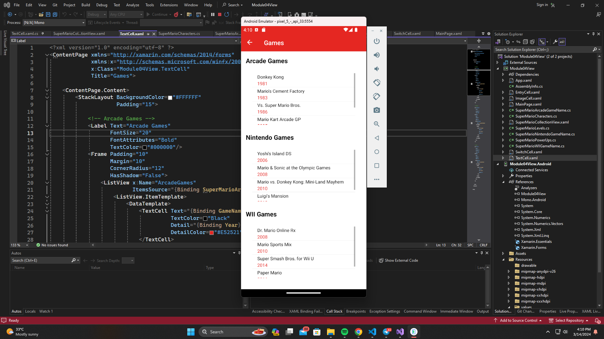
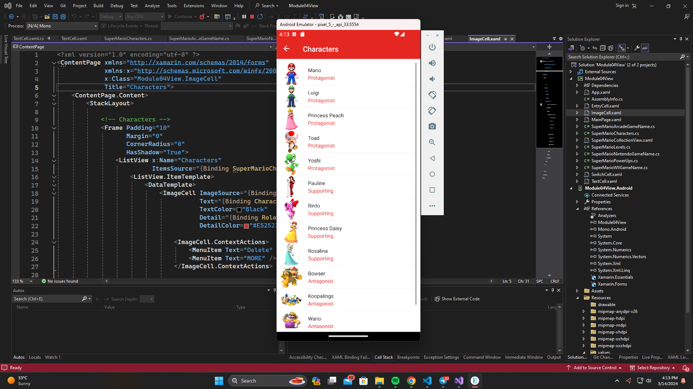
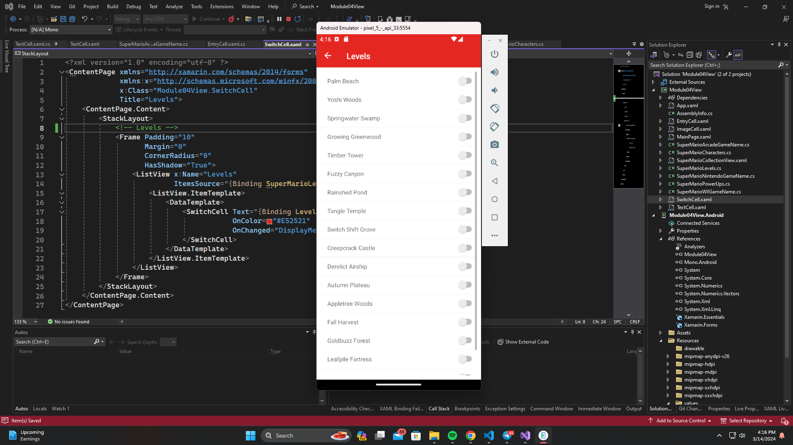
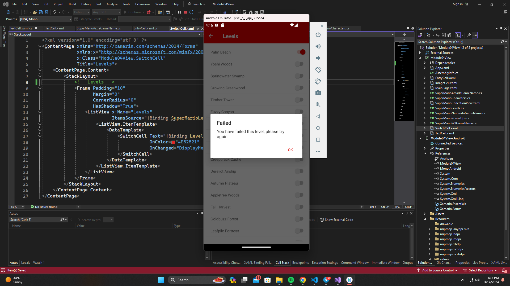
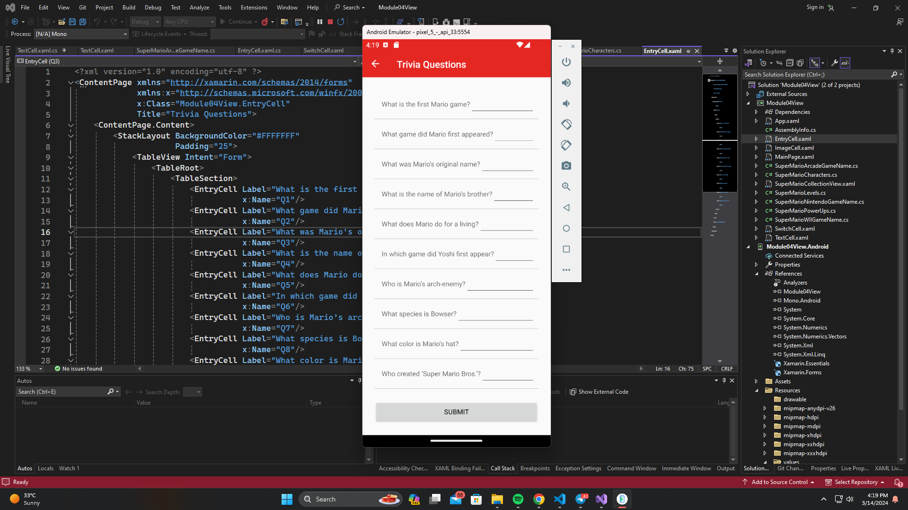
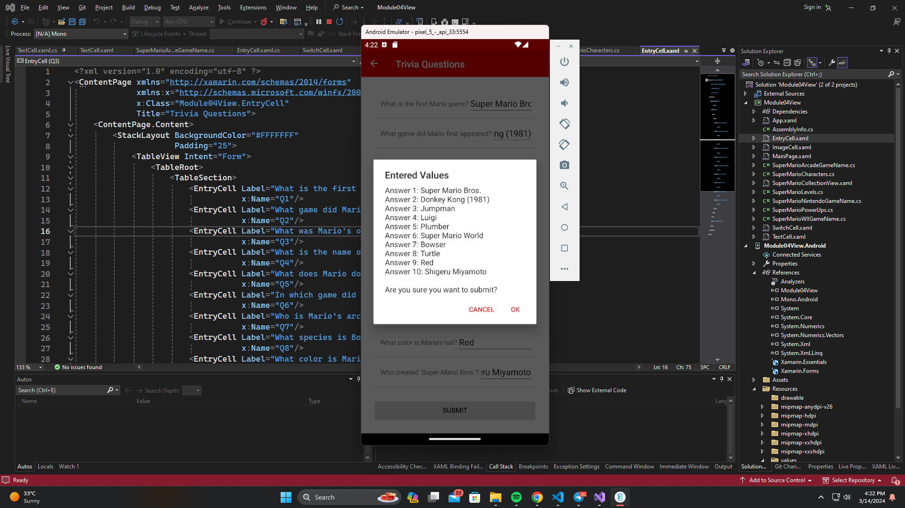
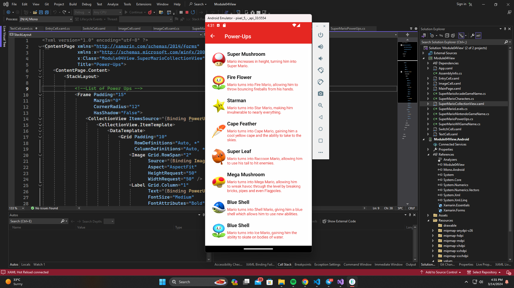
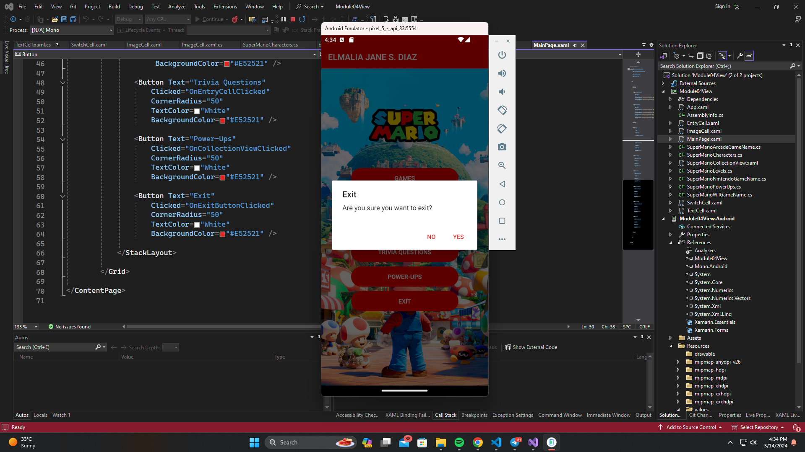

# Module 04 - Exercise 01 (PDC03-LAB)

    Name of Student: Elmalia Jane S. Diaz
    Year and Section: BSIT3A
    Activity Title: Module 04 - Exercise 01
    Date Submitted: March 14, 2024
    
## MainPage/Dashboard
### Source Code
- [MainPage.xaml](Module04View/Module04View/MainPage.xaml)
- [MainPage.xaml.cs](Module04View/Module04View/MainPage.xaml.cs)
### Output Screenshot

## TextCell
### Source Code
- [TextCell.xaml](Module04View/Module04View/TextCell.xaml)
- [TextCell.xaml.cs](Module04View/Module04View/TextCell.xaml.cs)
- [SuperMarioArcadeGameName.cs](Module04View/Module04View/SuperMarioArcadeGameName.cs)
- [SuperMarioNintendoGameName.cs](Module04View/Module04View/SuperMarioNintendoGameName.cs)
- [SuperMarioWIIGameName.cs](Module04View/Module04View/SuperMarioWIIGameName.cs)
### Output Screenshot

## ImageCell
### Source Code
- [ImageCell.xaml](Module04View/Module04View/ImageCell.xaml)
- [ImageCell.xaml.cs](Module04View/Module04View/ImageCell.xaml.cs)
- [SuperMarioCharacters.cs](Module04View/Module04View/SuperMarioCharacters.cs)
### Output Screenshot

## SwitchCell
### Source Code
- [SwitchCell.xaml](Module04View/Module04View/SwitchCell.xaml)
- [SwitchCell.xaml.cs](Module04View/Module04View/SwitchCell.xaml.cs)
- [SuperMarioLevels.cs](Module04View/Module04View/SuperMarioLevels.cs)
### Output Screenshots

## EntryCell
### Source Code
- [EntryCell.xaml](Module04View/Module04View/EntryCell.xaml)
- [EntryCell.xaml.cs](Module04View/Module04View/EntryCell.xaml.cs)
### Output Screenshots

## CollectionView
### Source Code
- [SuperMarioCollectionView.xaml](Module04View/Module04View/SuperMarioCollectionView.xaml)
- [SuperMarioCollectionView.xaml.cs](Module04View/Module04View/SuperMarioCollectionView.xaml.cs)
- [SuperMarioPowerUps.cs](Module04View/Module04View/SuperMarioPowerUps.cs)
### Output Screenshot

## DisplayAlert
### Source Code
- [MainPage.xaml](Module04View/Module04View/MainPage.xaml)
- [MainPage.xaml.cs](Module04View/Module04View/MainPage.xaml.cs)
### Output Screenshot

## Data Binding
- Data Binding was utilized when the types of ListView were created and in the CollectionView.